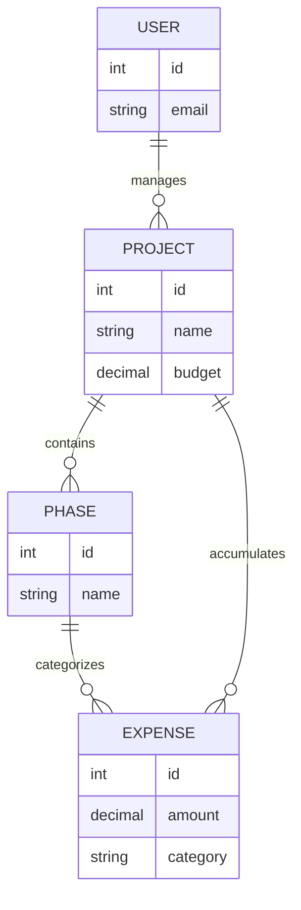

# 🏗️ BuildTrack Pro+ 

> **A Professional, Offline-First Construction Management Platform.**

BuildTrack Pro+ is a comprehensive, production-ready application designed to streamline construction project management, expense tracking, and material inventory. Built for the field, it ensures 100% uptime by allowing contractors to log critical data even without an internet connection.

---

## ✨ Key Features

### 🚀 Performance & Connectivity
*   📶 **Offline-First Engineering**: Log expenses and updates at remote job sites with zero signal. Data is securely queued locally and automatically syncs to the cloud when internet returns.
*   ⚡ **Progressive Web App (PWA)**: Installable on Android, iOS, and Desktop. Feels like a native app with fast loading and home screen access.
*   📡 **Live Network Status**: Real-time indicator shows whether you are working Online or in Local-Sync mode.

### 💰 Financial & Project Management
*   📊 **Intelligent Dashboard**: Real-time project health metrics, budget utilization, and weekly spending trends.
*   🧾 **AI-Powered OCR Scanning**: Take a photo of a receipt, and the app automatically extracts the **Amount**, **Vendor**, and **Date** using OCR.
*   📈 **Project Analytics**: Detailed breakdown of Labor vs. Material costs, Profit Margins, and daily burn rates.
*   📂 **Multi-Phase Tracking**: Break large projects into Foundation, Framing, Electrical, etc., for granular cost control.

### 🛠️ Logistics & Personnel
*   👷 **Crew Management**: Track workers, team assignments, and labor costs.
*   📦 **Inventory System**: Manage material stocks and equipment tracking across multiple sites.
*   📑 **Master Ledger**: A centralized, searchable database of every transaction ever made.

---

## 🧩 Data Model Overview

The database is designed around strict relational integrity to ensure financial accuracy across complex job sites.



### Core Hierarchy
- **Project → Phase → Expense**: Every transaction is tracked within a specific project and optionally assigned to a sub-phase (like Foundation or Plumbing).
- **Strict References**: Every expense must reference a valid Project and a Vendor to prevent "orphaned" financial records.

### Key Design Decisions
- **Enforced Foreign Keys**: Prevents orphaned financial records and ensures data consistency even when working offline.
- **Normalized Schema**: Eliminates the duplication and "formula rot" common in Excel-based construction workflows.
- **Optimized Indexing**: Frequently queried fields (like `project_id` and `vendor`) are indexed for high-performance reporting.

### Example Schema Definition
```sql
-- Represented via Drizzle ORM
CREATE TABLE expenses (
  id SERIAL PRIMARY KEY,
  project_id INTEGER NOT NULL REFERENCES projects(id) ON DELETE CASCADE,
  phase_id INTEGER REFERENCES phases(id) ON DELETE SET NULL,
  amount NUMERIC(12, 2) NOT NULL,
  category TEXT NOT NULL,
  vendor TEXT,
  date DATE NOT NULL,
  created_at TIMESTAMP WITH TIME ZONE DEFAULT NOW()
);
```

---

## 🛠️ Tech Stack

### Frontend
- **React 18** with **Vite** (TypeScript)
- **Tailwind CSS** + **shadcn/ui** for a premium, high-end design.
- **TanStack Query (React Query)** for robust data fetching and state management.
- **IndexedDB** for secure local storage and offline persistence.
- **Wouter** for lightweight, performant routing.

### Backend & Database
- **Node.js** + **Express.js** (TypeScript)
- **Drizzle ORM** for high-performance, type-safe database queries.
- **PostgreSQL** (Hosted on Neon for serverless scalability).
- **Zod** for end-to-end schema validation.
- **Bcrypt** for secure password hashing.

---

## 🚀 Getting Started

### Local Development (Quick Start)
1.  **Clone the Repository**:
    ```bash
    git clone https://github.com/Faizee669/Buildtrackpro.git
    cd Buildtrackpro
    ```
2.  **Environment Setup**:
    Create a `.env` file in the root with your credentials (see `.env.example`).
3.  **One-Click Start (Windows)**:
    Simply run the included `start-app.bat` file. It will automatically install dependencies and start both the Backend and Frontend servers for you.

### Manual Setup
1.  Install dependencies: `pnpm install`
2.  Start Backend: `cd artifacts/api-server && pnpm dev`
3.  Start Frontend: `cd artifacts/buildtrack && pnpm dev`

---

## 🌐 Deployment Architecture

The application is optimized for a decoupled production environment:
- **Frontend**: Deployed on **Vercel** with SPA routing support.
- **Backend**: Deployed on **Railway** with workspace-aware build scripts.
- **Auth Strategy**: Dual-Auth system using both **Cross-Domain Cookies** and **Token Fallbacks** (localStorage) to bypass aggressive browser cookie blocking.

---

## 🔧 Maintenance & Scripts
- `commit.js`: Utility script to quickly stage, commit, and push changes to GitHub.
- `railway.json`: Production build configuration for the Railway API server.
- `vercel.json`: Routing and rewrite rules for the Vercel frontend.

---

## 🔒 Security
- Secure session management with `SameSite: None` and `Secure` flags.
- Fallback Token-based authentication for cross-domain reliability.
- All API endpoints protected by authentication middleware.

---

**Developed for the Construction Industry by Faizan.**
