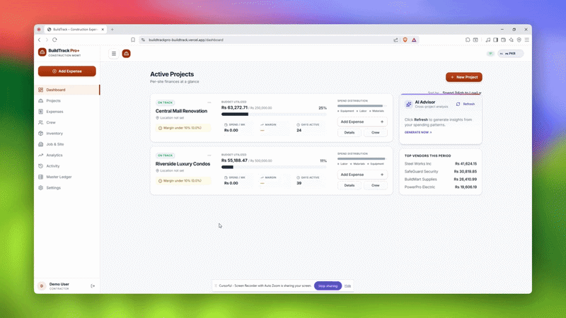
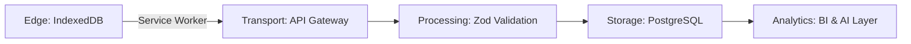
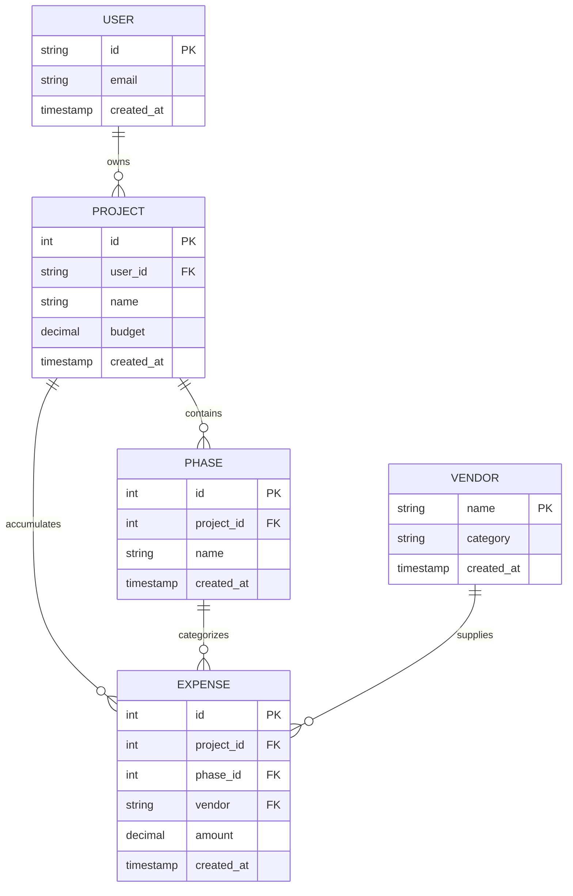

# 🏗️ BuildTrack Pro+ 

> **A Professional, Offline-First Construction Data Platform.**

BuildTrack Pro+ is engineered as a high-integrity **distributed data ingestion and analytics platform** designed for the construction industry. It solves the "Excel Problem" by migrating fragmented, unstructured workflows into a strictly normalized relational system that remains operational in zero-connectivity environments.

## 📺 App Demo



> **Pro Tip:** Replace the file above with your own recording to showcase the "wow" factor of the UI and offline sync!

---

## 🧨 Data Problem

Construction projects suffer from "Excel Rot"—disconnected spreadsheets, broken formulas, and fragmented data. BuildTrack Pro+ provides a centralized, relational system that ensures data integrity from the field to the dashboard.

---

## 🔄 Data Pipeline Architecture

The system is designed to handle high-fidelity financial data from the edge to the cloud:

- **Ingestion (Edge):** Offline capture via IndexedDB with local queueing.
- **Transport:** Background sync using Service Workers (batched + retry).
- **Processing:** Schema validation via Zod (client → API → DB).
- **Storage:** Normalized PostgreSQL with enforced relational constraints.
- **Consumption:** BI dashboards + AI analytics layer.



---

## 🧩 Data Model Overview

The database is designed around strict relational integrity to eliminate the redundancy and "formula rot" common in spreadsheet workflows.



### Data Modeling Decisions
- **Normalized Schema**: Designed to eliminate data redundancy and ensure a single source of truth for financial reporting.
- **Strict Relational Hierarchy**: **Project → Phase → Expense**. Enforced foreign keys prevent orphaned records and ensure 100% relational integrity.
- **Relational Vendor Management**: Moves vendor data from simple strings to a referenced `vendors` entity for professional supply-chain analytics.
- **Analytical Query Optimization**: Indexed frequently queried paths (vendor spend, phase budgets) for high-performance reporting.

### Example Schema Definition (Drizzle ORM)
```sql
CREATE TABLE expenses (
  id SERIAL PRIMARY KEY,
  project_id INTEGER NOT NULL REFERENCES projects(id) ON DELETE CASCADE,
  phase_id INTEGER REFERENCES phases(id) ON DELETE SET NULL,
  vendor_id TEXT REFERENCES vendors(name) ON DELETE SET NULL,
  amount NUMERIC(12, 2) NOT NULL,
  category TEXT NOT NULL,
  date DATE NOT NULL,
  created_at TIMESTAMP WITH TIME ZONE DEFAULT NOW()
);
```

---

## 🤖 AI as a Data Processing Layer

Instead of a static feature, BuildTrack Pro+ implements an **unstructured data processing pipeline** using LLMs:

- **Data Extraction**: Converts unstructured physical receipt images into structured JSON payloads.
- **Normalization**: Maps diverse vendor descriptions into standardized relational formats.
- **Downstream Analytics**: Feeds normalized data into BI dashboards for real-time cost anomaly detection.

---

## 🛠️ Data Engineering Focus

BuildTrack Pro+ is built on core data engineering principles to ensure reliability and scalability:

- **Unstructured Data → Structured Data Migration**: Transforms messy field notes and receipt photos into a rigorous SQL format.
- **Reliable Distributed Data Ingestion**: Handles eventual consistency and data synchronization from edge devices.
- **Data Reliability Layer**: Implements retry mechanisms for failed syncs and **idempotent API design** to prevent duplicate writes during retries.
- **Type-Safe Data Contracts**: Ensures data remains valid at every hop of the pipeline (Zod + TypeScript).

---

## 🧰 Data Engineering Stack Mapping

- **Ingestion:** IndexedDB, Service Workers (Offline Queue)
- **Processing:** Node.js, Express, Zod (Validation Layer)
- **Storage:** PostgreSQL (Neon Serverless)
- **Modeling:** Drizzle ORM (Type-safe Relational Modeling)
- **Analytics:** Recharts (BI Visualization), LLM OCR Pipeline

---

## 🚀 Getting Started

### Local Development (Quick Start)
1.  **Clone the Repository**:
    ```bash
    git clone https://github.com/Faizee669/Buildtrackpro.git
    cd Buildtrackpro
    ```
2.  **Environment Setup**:
    Create a `.env` file in the root with your credentials.
3.  **One-Click Start (Windows)**:
    Run the included `start-app.bat` to automatically install dependencies and start both servers.

---

## 🌐 Deployment Architecture

- **Frontend**: Hosted on **Vercel** with SPA routing rewrites.
- **Backend API**: Hosted on **Railway** with workspace-aware build scripts.
- **Security**: Dual-Auth strategy using cross-domain cookies and fallback `localStorage` tokens.

---

**Built to reflect production-grade data engineering systems, including ingestion, validation, modeling, and analytics.**

**Developed for the Construction Industry by Faizan.**
