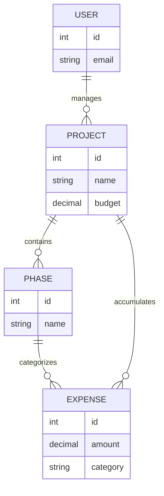

# 🏗️ BuildTrack Pro+ 

> **A Professional, Offline-First Construction Data Platform.**

BuildTrack Pro+ is engineered as a high-integrity **distributed data ingestion and analytics platform** designed for the construction industry. It solves the "Excel Problem" by migrating fragmented, unstructured workflows into a strictly normalized relational system that remains operational in zero-connectivity environments.

---

## 🔄 Data Pipeline Architecture

The system is designed to handle high-fidelity financial data from the edge to the cloud:

1.  **Ingestion (Edge)**: Data captured offline via mobile devices (IndexedDB) and stored in a resilient local queue.
2.  **Transport**: Reliable distributed data ingestion using Service Workers to batch sync API requests when connectivity is restored.
3.  **Processing**: Multi-stage validation using Zod schemas to ensure type-safe contracts from Client → API → Database.
4.  **Storage**: Fully normalized PostgreSQL (Neon) storage with enforced relational constraints.
5.  **Consumption**: Real-time BI dashboards and an AI-powered analytics layer for anomaly detection.

---

## 🧩 Data Model Overview

The database is designed around strict relational integrity to eliminate the redundancy and "formula rot" common in spreadsheet workflows.



### Data Modeling Decisions
- **Normalized Schema**: Designed to eliminate data redundancy and ensure a single source of truth for financial reporting.
- **Strict Foreign Key Hierarchy**: **Project → Phase → Expense**. Prevents orphaned records and ensures 100% relational integrity.
- **Analytical Query Optimization**: Frequently queried paths (vendor spend, phase budgets, project totals) are indexed for low-latency BI reporting.
- **Edge Resilience**: Foreign key consistency is maintained in local IndexedDB stores to ensure offline data remains valid for cloud ingestion.

### Example Schema Definition (Drizzle ORM)
```sql
CREATE TABLE expenses (
  id SERIAL PRIMARY KEY,
  project_id INTEGER NOT NULL REFERENCES projects(id) ON DELETE CASCADE,
  phase_id INTEGER REFERENCES phases(id) ON DELETE SET NULL,
  amount NUMERIC(12, 2) NOT NULL,
  category TEXT NOT NULL,
  vendor TEXT,
  date DATE NOT NULL,
  created_at TIMESTAMP WITH TIME ZONE DEFAULT NOW()
);
```

---

## 🤖 AI as a Data Processing Layer

Instead of a static feature, BuildTrack Pro+ implements an **unstructured data processing pipeline** using LLMs:

- **Data Extraction**: Converts unstructured physical receipt images into structured JSON payloads.
- **Normalization**: Maps diverse vendor descriptions and dates into standardized relational formats.
- **Downstream Analytics**: Feeds normalized data into BI dashboards for real-time cost anomaly detection.

---

## 🛠️ Data Engineering Focus

BuildTrack Pro+ is built on core data engineering principles to ensure reliability and scalability:

- **Unstructured Data → Structured Data Migration**: Transforms messy field notes and receipt photos into a rigorous SQL format.
- **Reliable Distributed Data Ingestion**: Handles eventual consistency and data synchronization from edge devices.
- **Data Reliability Layer**: Implements retry mechanisms for failed syncs and a robust conflict resolution strategy for multi-device environments.
- **Type-Safe Data Contracts**: Ensures data remains valid at every hop of the pipeline (Zod + TypeScript).

---

## 🧰 Data Engineering Stack Mapping

- **Ingestion:** IndexedDB, Service Workers (Offline Queue)
- **Processing:** Node.js, Express, Zod (Validation Layer)
- **Storage:** PostgreSQL (Neon Serverless)
- **Modeling:** Drizzle ORM (Type-safe Relational Modeling)
- **Analytics:** Recharts (BI Visualization), LLM OCR Pipeline

---

## 🚀 Getting Started

### Local Development (Quick Start)
1.  **Clone the Repository**:
    ```bash
    git clone https://github.com/Faizee669/Buildtrackpro.git
    cd Buildtrackpro
    ```
2.  **Environment Setup**:
    Create a `.env` file in the root with your credentials.
3.  **One-Click Start (Windows)**:
    Run the included `start-app.bat` to automatically install dependencies and start both servers.

---

## 🌐 Deployment Architecture

- **Frontend**: Hosted on **Vercel** with SPA routing rewrites.
- **Backend API**: Hosted on **Railway** with workspace-aware build scripts.
- **Security**: Dual-Auth strategy using cross-domain cookies and fallback `localStorage` tokens.

---

**Developed for the Construction Industry by Faizan.**
